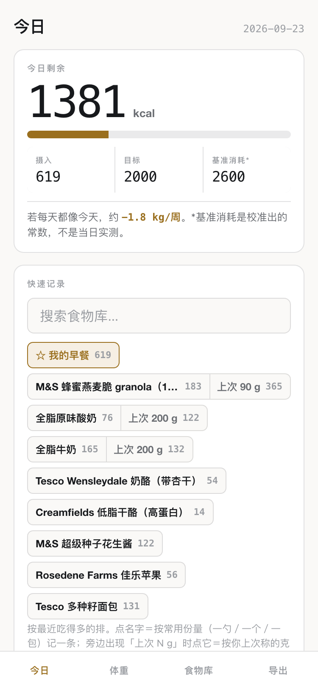
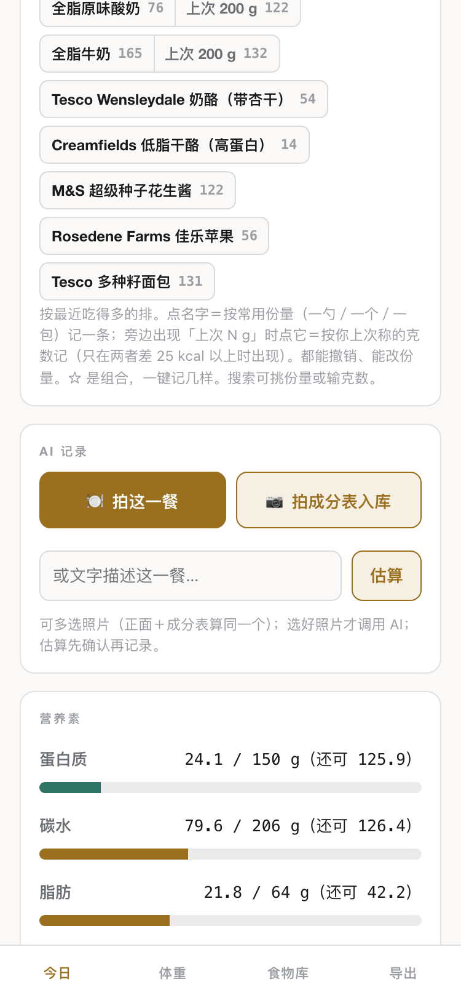
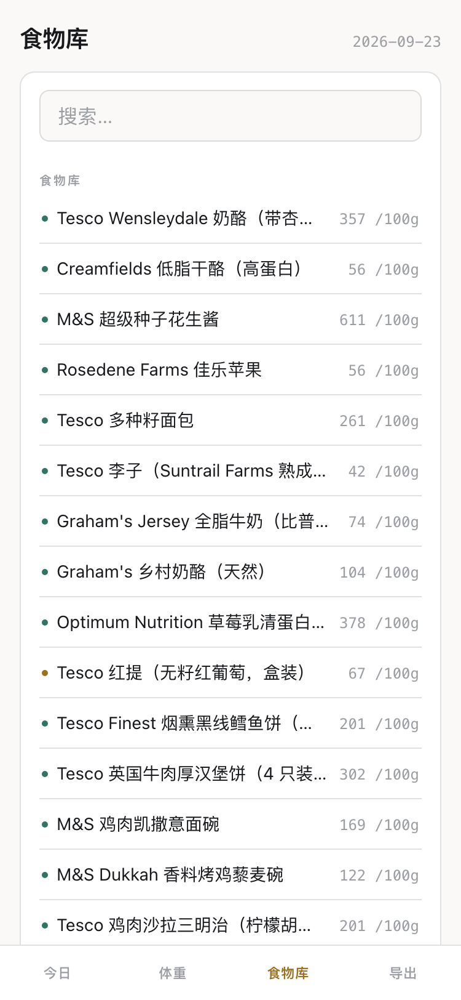

# Calorie Tracker (热量记录)

**English** | [简体中文](README.zh-CN.md)

A single-file, offline-first calorie and macro tracker built for the phone home screen, with AI food recognition, arithmetic cross-checks on everything the model reads, and weekly calibration of the energy-balance constants against real morning-weight data.

**Live:** https://jackieyangjq.github.io/caltrk/ (add it to the iOS home screen; all data stays in the browser). The UI is in Chinese.

| Today | AI recognition | Food library |
|---|---|---|
|  |  |  |

## What it does

- **One-tap logging.** Quick-record chips are ranked by recency-weighted frequency (one use in the last 7 days counts about as much as three uses a month ago), with two tap targets per food: the usual portion (a scoop, one piece, one pack) and "last weighed N g". Every log can be undone for a few seconds.
- **AI recognition, bring your own key.** Photograph a meal, photograph a nutrition label, or type a description. A vision model returns one JSON object (per-100 g kcal, protein, fat, carb, pack size, suggested portions). Nothing is saved until you confirm the name and grams in a review sheet.
- **Cross-checks on every label the model reads.** An Atwater check (4/4/9 kcal per gram of protein/carb/fat against the printed kcal, flagged above 30% deviation) and a whole-pack check (per-100 g × pack grams against the printed pack kcal, flagged above 12%), which catches the common failure of reading a per-serving column as per-100 g. An optional second model re-reads the same photos and the app diffs the two readings.
- **Daily budget and macros.** Remaining kcal, protein target, carb and fat caps, a training log, a morning-weight anchor, 7/14-day history, and the ability to open any past day to back-fill or edit it.
- **Nothing leaves the phone** except the photo or text you explicitly send to the model endpoint. Data lives in localStorage; export is a JSON file; storage corruption is detected and the raw data is rescued into the export.

## How the AI recognition works

```
photo / text ──▶ OpenAI-compatible chat-completions endpoint (model selectable in-app)
                 system prompt: "output exactly one JSON object" ──▶ parse
                 ──▶ arithmetic cross-checks (Atwater, whole-pack) ──▶ optional 2nd-model diff
                 ──▶ review sheet (edit name / grams) ──▶ log entry
```

The model never writes to the log directly. If the request fails or times out (60 s), the app points you to the manual "estimated entry" path so the meal is still recorded.

## How the constants are calibrated

The maintenance-expenditure and daily-target constants are not guessed once and forgotten. In a weekly review, a least-squares trend is fitted to morning weights, the energy balance is back-solved, and the result is compared with a robust fit and a segmented fit. The constants move only when the interval is tight enough to mean something.

- Review 1 (5 morning weights): correctly concluded "not enough data"; constants unchanged.
- Review 3 (16 morning weights over 18 days): first statistically significant trend; both constants updated.

The constants ship in the build rather than in localStorage, so a deploy updates them without touching the user's records.

## Design decisions

- **Single HTML file, no build step, no framework.** About 2,300 lines, deployed by pushing to GitHub Pages. The constraint kept scope honest and made every release a one-file diff.
- **Offline-first, localStorage only.** No accounts, no server. The first three commits were storage probes to verify that data survives a Pages redeploy and the separate storage container of an iOS home-screen app.
- **Curated seed library, overlay corrections.** The seed foods (mostly UK supermarket items) carry label-read values that passed the arithmetic cross-check. A user-added food is promoted into the seed library only after two or more uses and a passing check. Corrections and merges are applied as overlays at read time, so entries already stored on the phone are never rewritten.
- **Model calls kept provider-agnostic.** One request function against an OpenAI-compatible chat-completions endpoint (a proxy by default); the model is a dropdown or free text. Parameter differences between model families (for example, models that reject a custom temperature) are handled in one place.

## Changelog

| Version | Date | Change |
|---|---|---|
| probes | 2026-08-08 | Three storage probes: does localStorage survive Pages redeploys and the iOS home-screen container? |
| 1.0 | 2026-08-08 | First release: today page, 20 seed foods, first-week mode, export/backup |
| 1.1 | 2026-08-08 | "How much of it" selector for estimated entries; first label photos into the library |
| 1.2 | 2026-08-31 | One-tap logging with undo; inline grams; morning-weight anchor; nudge bar; data-loss hardening; iOS pinyin input fix |
| 1.4–1.5 | 2026-09-01 | Macros; training log; AI recognition (key settings, photo, text) |
| 1.6 | 2026-09-01 | AI recording as its own section (meal photo / label photo / text), multi-photo, review sheet |
| 1.7 | 2026-09-01 | Arithmetic cross-checks on label reads; model dropdown; optional second-model review |
| 1.8 | 2026-09-02 | Today page reflow; 7-day card; history with progress bars; combos; multi-entry undo |
| 1.9 | 2026-09-06 | First weekly review: 4 personal foods promoted, 8 retired via overlays |
| 1.10 | 2026-09-12 | Recency-weighted ranking everywhere; retire list split into "same-as" and "fix" overlays |
| 1.11 | 2026-09-12 | Two tap targets per food: usual portion and "last N g" |
| 1.12 | 2026-09-15 | Browse and edit any past day, with guards against logging to the wrong date |
| 1.13 | 2026-09-20 | Third calibration: constants updated from 18 days of morning weights; label values verified against retailer data |

## What I would do differently

- Split the file into modules once it passed about 1,500 lines; a build step would have paid for itself.
- Add a small test harness for the pure functions: the Atwater check, the recency ranking, day boundaries.
- Move the calibration fit into the app so the weekly review closes the loop automatically.
